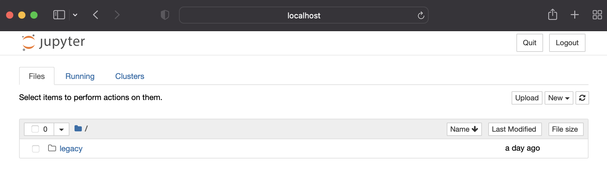
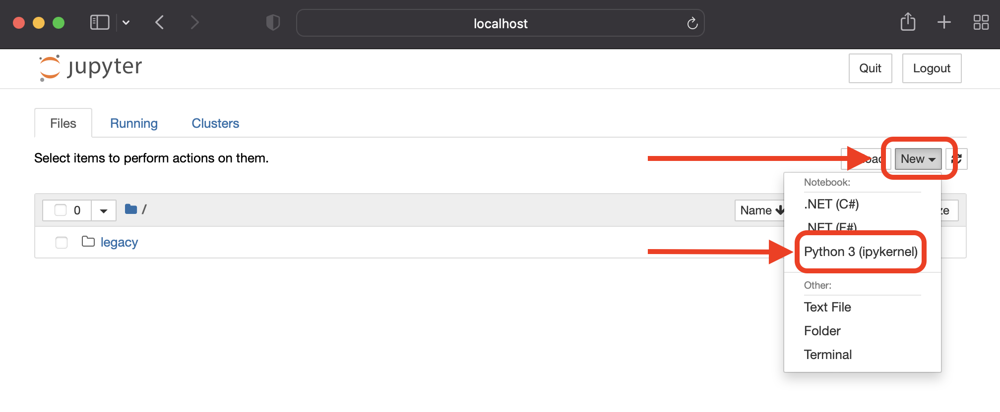
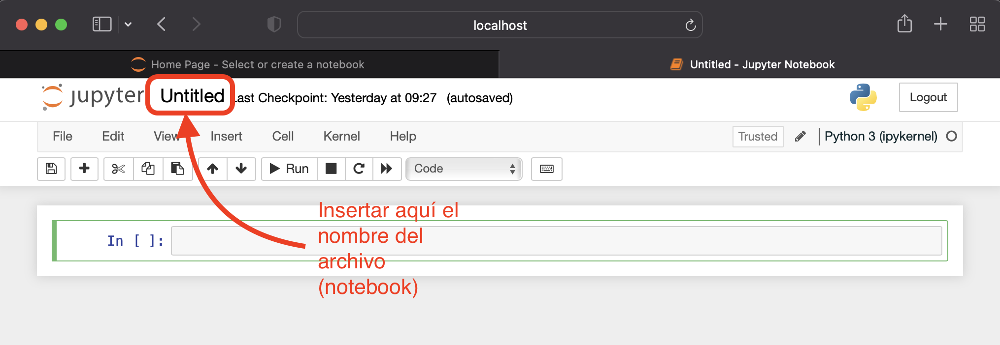

## Introducción

En este módulo vamos a dedicarnos a preparar nuestro entorno de desarrollo,
que va a requerir de los siguientes componentes:

- [Python](): Será nuestro lenguaje de programación. Las ventajas de este lenguaje de
  programación son innumerables, e.g. permite escribir código conciso y fácilmente
  inteligible, hay una comunidad ingente de desarrolladores de código abierto soportando
  numerosas librerías públicas que nos hacen la programación mucho más sencilla, existe una
  cantidad ingente de librerías analíticas que han hecho de este el lenguaje de facto
  para la programación en áreas de gran interés como Machine Learning, etc. En este curso,
  a no ser que digamos lo contrario en algún ejemplo en particular, usaremos
  [Python 3.8](https://www.python.org/downloads/release/python-380/).


- [Conda](): Conda es un sistema de administración de paquetes y entornos de desarrollo
  disponible para los principales sistemas operativos (OS, de sus siglas en inglés):

    - [Windows](https://docs.conda.io/projects/conda/en/latest/user-guide/install/windows.html)

    - [macOS](https://docs.conda.io/projects/conda/en/latest/user-guide/install/macos.html)

    - [Linux](https://docs.conda.io/projects/conda/en/latest/user-guide/install/linux.html)

  Conda instala, ejecuta y actualiza rápidamente paquetes y sus dependencias de manera
  sencilla y efectiva. Con la línea de comandos seremos capaces de crear, guardar, cargar
  y cambiar fácilmente entre entornos, lo que nos será muy útil para aislar entornos de
  trabajo y conseguir robustez en nuestros desarrollos. Inicialmente se creó para la
  gestión de programas Python, pero a día de hoy puede empaquetar y distribuir software
  para cualquier lenguaje.


- [Jupyter](https://jupyter.org/): Un entorno web interactivo de desarrollo, ideal para
  la exploración y el desarrollo de informes técnicos. Su interfaz flexible permite la configuración
  y organización de flujos de trabajo para analítica avanzada, computación científica,
  periodismo computacional y *Machine Learning*. Las instrucciones para su instalación
  se pueden encontrar [aquí](https://jupyter.org/install).

## Python y Conda

En el apartado anterior hemos comentado que el lenguaje de programación usado en este curso
será Python, y hemos también hecho mención al gestor de entornos Conda (también se suele
referir como Anaconda, aunque Conda es el administrador de paquetes mientras que Anaconda
es un conjunto de alrededor de cien paquetes que incluye entre otros: conda, numpy, scipy,
ipython notebook, etc.) Procedamos a entender un poco mejor su interrelación y
utilización mediante una serie de preguntas y respuestas:


### ¿Tengo que instalar python y conda?

La respuesta rápida es que *NO*. Utilizaremos
Conda como gestor de entornos, y será Conda quien gestione la instalación y activación
de la versión de python que necesitemos cuando procedamos a la creación de un entorno.

### ¿Qué tengo que hacer para instalar conda?
Esto depende un poco del OS con el que estés
trabajando como hemos comentado en el apartado anterior. En cualquier caso, a continuación
apuntamos los comandos a ejecutar por terminal en caso que prefiramos hacer una instalación
programática:

*Windows*:
```shell
> winget install -e --id Anaconda.Anaconda3
```

*Linux*:
```shell
> wget https://repo.anaconda.com/archive/Anaconda3-2021.11-Linux-x86_64.sh && \
chmod a+x Anaconda3-2021.11-Linux-x86_64.sh && \
./Anaconda3-2021.11-Linux-x86_64.sh
```

*macOS*:
```shell
> wget https://repo.anaconda.com/archive/Anaconda3-2021.11-MacOSX-x86_64.sh && \
chmod a+x Anaconda3-2021.11-MacOSX-x86_64.sh && \
./Anaconda3-2021.11-MacOSX-x86_64.sh 
```

### ¿Cómo sé si se ha instalado bien?
Si has ejecutado estos comandos y has ido guiando la instalación de conda en tu terminal, 
al finalizar tendrás que reiniciar tu terminal para asegurarte que la dirección de conda 
está cargada en el PATH. Cuando lo hayas hecho, deberías poder ejecutar el siguiente
comando:
```shell
> conda --version
conda 4.8.2
```

### Gestión de entornos con conda

Una vez hemos comprobado que podemos usar la línea de comandos recien instalada, vamos a 
proceder a la creación de nuestro primer entorno Python. En particular, vamos a crear un
entorno con el nombre `swa-dev` (inspirados por las iniciales del curso, y añadiendod `dev`
para remarcar que estamos en la etapa de desarrollo), con `Python 3.8`:

```shell
> conda create --name swa-dev python=3.8 --yes
```

El parámetro adicional `--yes` lo hemos añadido para pasarlo directamente a la pregunta:

```shell
The following NEW packages will be INSTALLED:

  ca-certificates    pkgs/main/osx-64::ca-certificates-2021.10.26-hecd8cb5_2
  certifi            pkgs/main/osx-64::certifi-2021.10.8-py38hecd8cb5_2
  libcxx             pkgs/main/osx-64::libcxx-12.0.0-h2f01273_0
  libffi             pkgs/main/osx-64::libffi-3.3-hb1e8313_2
  ncurses            pkgs/main/osx-64::ncurses-6.3-hca72f7f_2
  openssl            pkgs/main/osx-64::openssl-1.1.1m-hca72f7f_0
  pip                pkgs/main/osx-64::pip-21.2.4-py38hecd8cb5_0
  python             pkgs/main/osx-64::python-3.8.12-h88f2d9e_0
  readline           pkgs/main/osx-64::readline-8.1.2-hca72f7f_1
  setuptools         pkgs/main/osx-64::setuptools-58.0.4-py38hecd8cb5_0
  sqlite             pkgs/main/osx-64::sqlite-3.37.0-h707629a_0
  tk                 pkgs/main/osx-64::tk-8.6.11-h7bc2e8c_0
  wheel              pkgs/main/noarch::wheel-0.37.1-pyhd3eb1b0_0
  xz                 pkgs/main/osx-64::xz-5.2.5-h1de35cc_0
  zlib               pkgs/main/osx-64::zlib-1.2.11-h4dc903c_4
```

en la que se nos informa (pausando la creación del entorno hasta que se de autorización)
de los diferentes paquetes que serán instalados en la creación de nuestro nuevo entorno
llamado `swa-dev`.

Una vez terminada la creación, deberemos haber obtenido un mensaje como el que sigue:
```shell
# To activate this environment, use
#
#     $ conda activate swa-dev
#
# To deactivate an active environment, use
#
#     $ conda deactivate
```
que nos informa de los dos comandos que tendremos que usar para la activación y desactivación
del entorno. Si queremos saber que entornos tenemos creados ahora mismo en nuestro sistema,
podemos usar el siguiente comando:
```shell
> conda env list

# conda environments:
#
base                  *  /YOUR_USER_PATH/anaconda3
swa-dev                  /YOUR_USER_PATH/anaconda3/envs/swa-dev
```
El símbolo `*` denota que tenemos activado el entorno por defecto (`base`). Para comenzar
con nuestro curso, vamos a proceder a la activación del entorno:
```shell 
> conda activate swa-dev && conda env list
 
# conda environments:
#
base                     /YOUR_USER_PATH/anaconda3
swa-dev               *  /YOUR_USER_PATH/anaconda3/envs/swa-dev
```

Para ver que estas en un entorno completamente limpio, puedes usar el comando `pip freeze`
que te indicará las dependencias instaladas (deberías obtener algo similar a lo siguiente):
```shell
> pip freeze

certifi==2021.10.8
oauthlib==3.1.1
requests-oauthlib==1.3.0
```

## Jupyter Notebooks

Ahora que ya tenemos creado y activado nuestro entorno de desarrollo, vamos a instalar 
Jupyter en este entorno. Para ello, simplemente tenmos que hacer uso del gestor `pip`:
```shell
> pip install notebook

Collecting notebook
  Using cached notebook-6.4.7-py3-none-any.whl (9.9 MB)
Collecting jupyter-client>=5.3.4
  Using cached jupyter_client-7.1.0-py3-none-any.whl (129 kB)
Collecting argon2-cffi
  Using cached argon2_cffi-21.3.0-py3-none-any.whl (14 kB)
Collecting tornado>=6.1
  Using cached tornado-6.1-cp38-cp38-macosx_10_9_x86_64.whl (416 kB)
Collecting jinja2
  Using cached Jinja2-3.0.3-py3-none-any.whl (133 kB)
Collecting ipykernel
...
...
...
Successfully installed MarkupSafe-2.0.1 Send2Trash-1.8.0 appnope-0.1.2 argon2-cffi-21.3.0
 argon2-cffi-bindings-21.2.0 asttokens-2.0.5 attrs-21.4.0 backcall-0.2.0 black-21.12b0 
 bleach-4.1.0 cffi-1.15.0 click-8.0.3 debugpy-1.5.1 decorator-5.1.1 defusedxml-0.7.1 
 entrypoints-0.3 executing-0.8.2 importlib-resources-5.4.0 ipykernel-6.7.0 ipython-8.0.0 
 ipython-genutils-0.2.0 jedi-0.18.1 jinja2-3.0.3 jsonschema-4.4.0 jupyter-client-7.1.0 
 jupyter-core-4.9.1 jupyterlab-pygments-0.1.2 matplotlib-inline-0.1.3 mistune-0.8.4 
 mypy-extensions-0.4.3 nbclient-0.5.10 nbconvert-6.4.0 nbformat-5.1.3 nest-asyncio-1.5.4 
 notebook-6.4.7 packaging-21.3 pandocfilters-1.5.0 parso-0.8.3 pathspec-0.9.0 pexpect-4.8.0 
 pickleshare-0.7.5 platformdirs-2.4.1 prometheus-client-0.12.0 prompt-toolkit-3.0.24 
 ptyprocess-0.7.0 pure-eval-0.2.1 pycparser-2.21 pygments-2.11.2 pyparsing-3.0.6 
 pyrsistent-0.18.0 python-dateutil-2.8.2 pyzmq-22.3.0 six-1.16.0 stack-data-0.1.3 
 terminado-0.12.1 testpath-0.5.0 tomli-1.2.3 tornado-6.1 traitlets-5.1.1 
 typing-extensions-4.0.1 wcwidth-0.2.5 webencodings-0.5.1 zipp-3.7.0
```

🥳 Enhorabuena! ya tienes instalado Jupyter Notebooks.  

Ahora ya podemos empezar a crear nuestro primer *Jupyter Notebook*, para lo cual podemos 
proceder del modo estándar, i.e.:
```shell
> jupyter-notebook
```
Lo que nos abrirá una ventana en nuestro explorador web, mostrando el árbol del directorio
donde hemos ejecutado el comando:



A posteriori, solo tenemos que hacer click en `New` > `Python 3 (ipykernel)`:



Lo que finalmente nos llevará al notebook:



Y con esto tendremos creado y guardado nuestro primer fichero `.ipynb` (jupyter notebook).
Para hacer esta tarea menos tediosa y más directa a nivel programático, se puede usar el
script [create-notebook](create-notebook.sh) de la siguiente forma:
```shell
> chmod a+x create-notebook && ./create-notebook nombre_del_notebook
```
Este comando creará un notebook con el nombre `nombre_del_notebook.ipynb`, y lo abrirá a
continuación, todo con una sola línea de comando.
A continuación podemos ver que la versión de python de nuestro notebook es exactamente la 
del entorno en el que estamos ejecutándolo (para comprobar que estamos en el entorno correcto).
Para ello solo tenemos que añadir un bloque de código al notebook con el 
siguiente contenido:
```python
import sys
sys.version
```
y ejecutar el bloque, deberíamos obtener `3.8.12` (a día 14/Enero/2022).
El notebook creado con susodicho bloque de código se puede ver [aquí](example-ipynb/example-nb.ipynb).