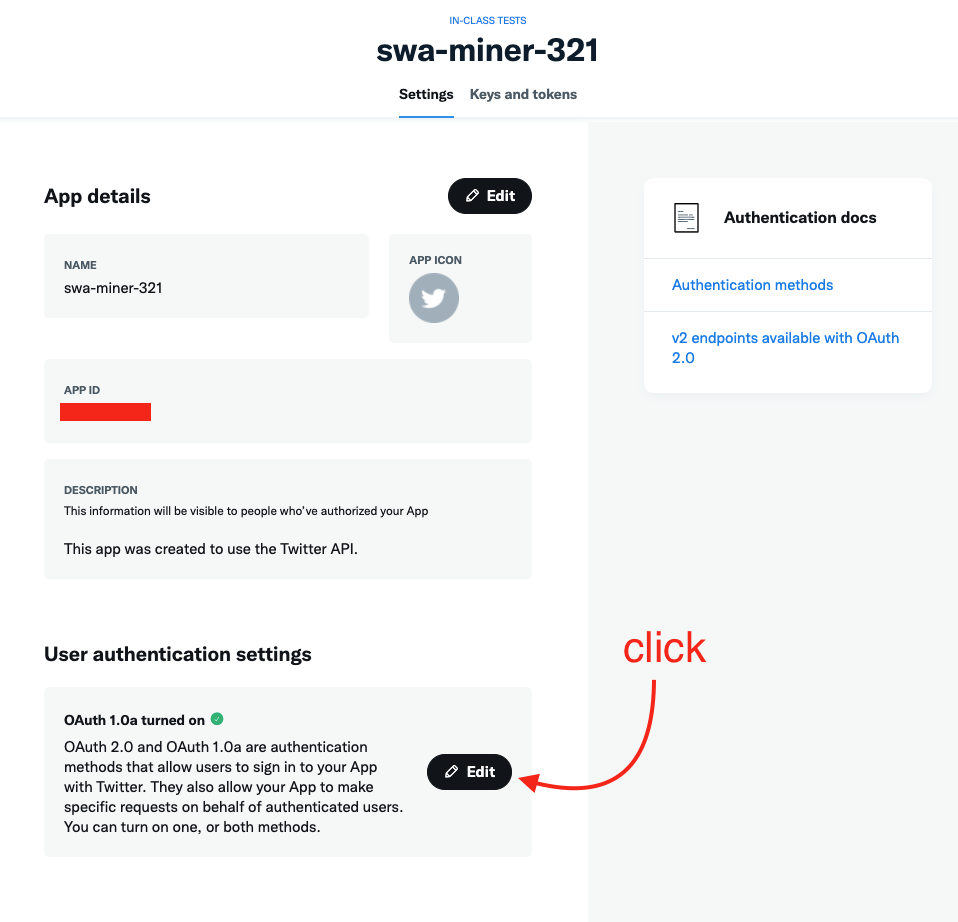
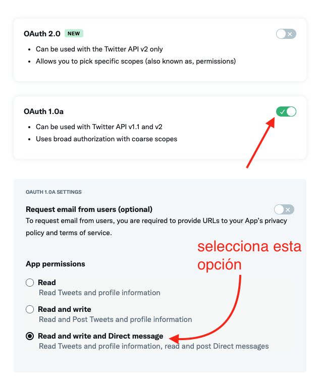
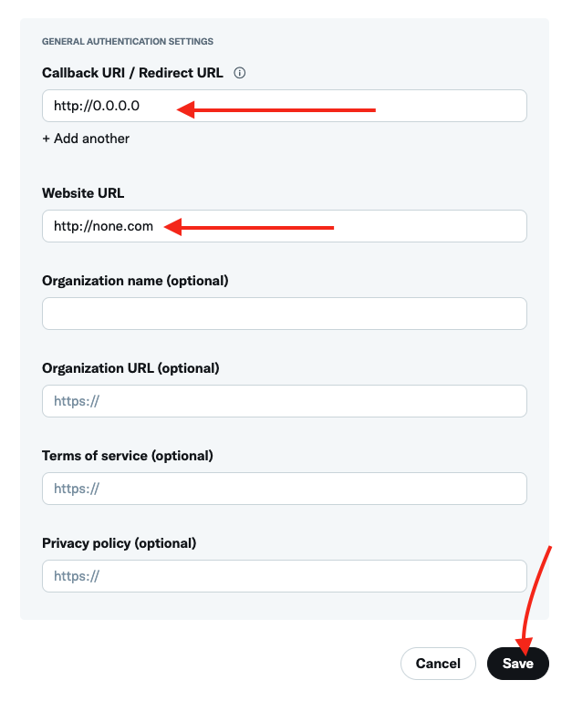
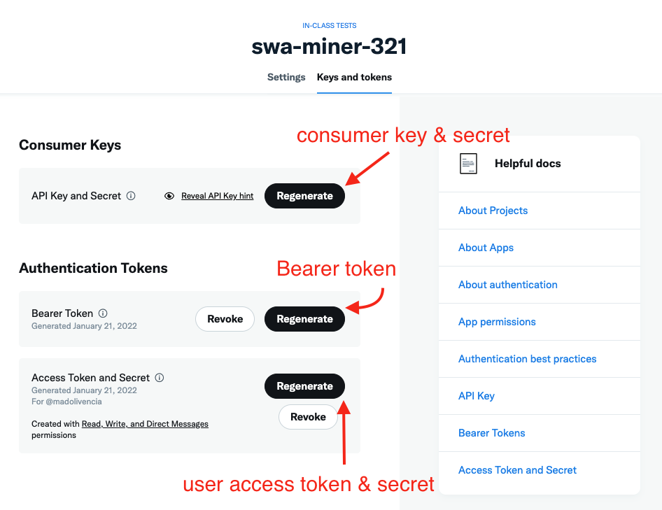

### Conexión a la API de Twitter

En este módulo podemos consultar dos Jupyter notebooks que nos
muestran las dos posibles formas de consumir la API de Twitter:

- [Usando la API sin librerías](twitter-api-v2-raw.ipynb)
- [Usando la librería tweepy](twitter-api-v2-tweepy.ipynb)

Antes de proceder a ejecutar el código, tendrás que:

1. Registrate como desarrollador en la página de Twitter: [link](https://developer.twitter.com/en)
2. Acceder al portal del desarrollador: [link](https://developer.twitter.com/en/portal/dashboard)
3. Crear un proyecto y una aplicación en ese mismo proyecto
4. Acceder a la configuración de la aplicación:

5. Activar `OAuth1`:
   

  

   
6. Generar claves de autenticación y guardarlas en archivo `JSON`, siguiendo el template
   que tenemos [aquí](../../auth/twitter_credentials%5Btemplate%5D.json)
    - Consumer keys
    - Bearer Token
    - User keys
      

