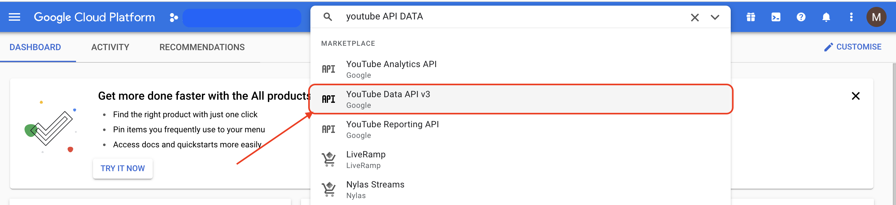
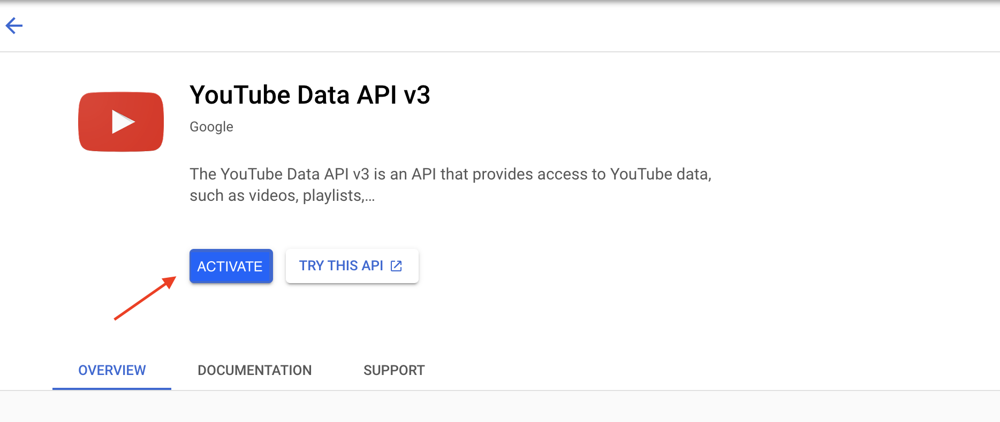
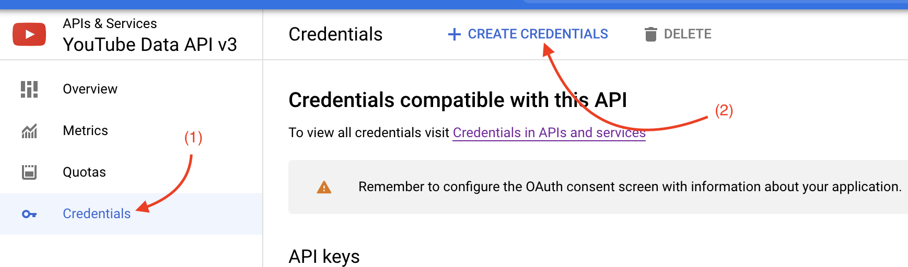

### Usando la API de YouTube

Antes de proceder a ejecutar el código que puedes encontrar [aquí](youtube-api.ipynb),
tendrás que:

1. Activar la API de YouTube Data en Google Cloud Platform (GCP).
   Para ello, visita el poral web de GCP [aquí](https://console.cloud.google.com/).
   Una vez allí, busca "YouTube Data API v3" en la barra de búsqueda:
   
   
   
   

2. Una vez activada, entraremos en el portal de la API y podremos acceder a la sección
   de credenciales, y pulsar crear nuevos, posteriormente seleccionar el tipo "API Key":
   
   

3. Una vez las credenciales han sido generadas, guardarlas en un archivo `JSON`,
   siguiendo el template que tenemos [aquí](../../auth/youtube_credentials%5Btemplate%5D.json).
   
