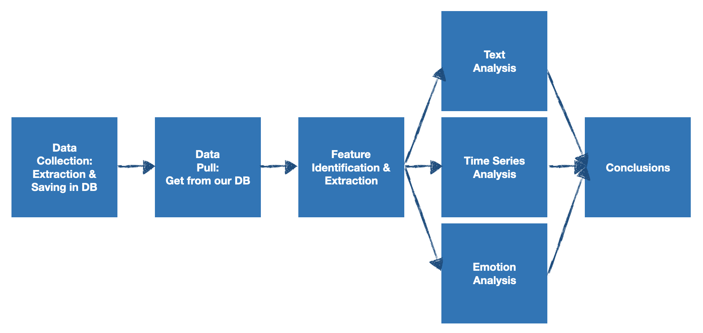
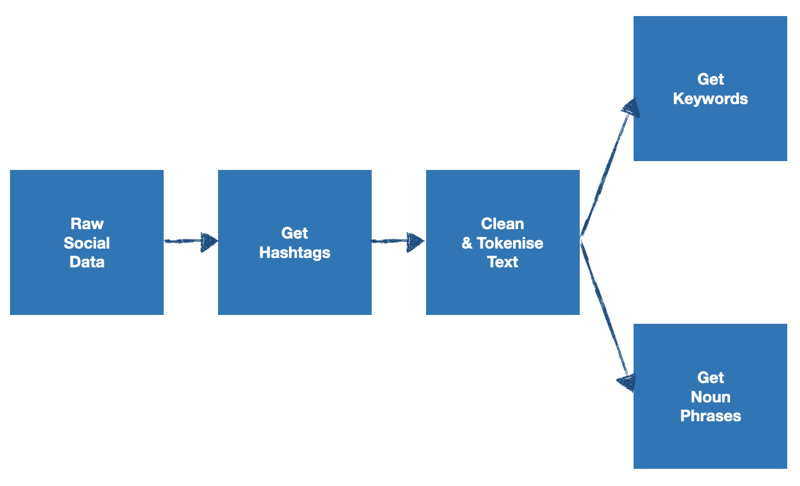
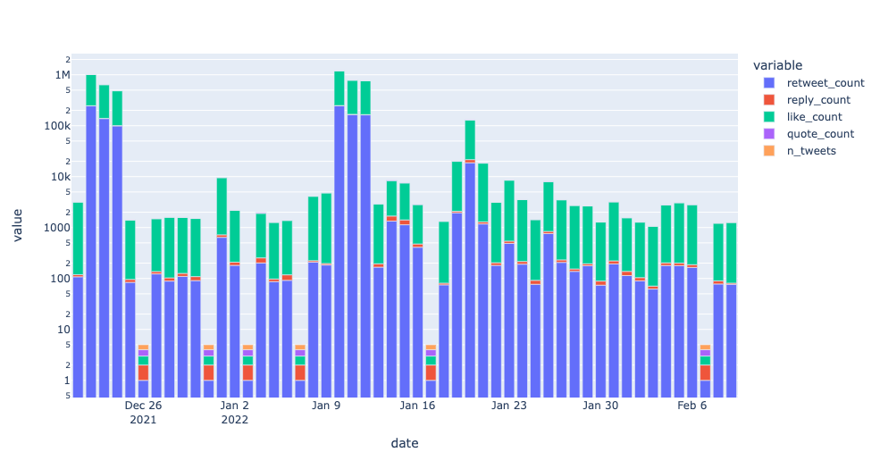

## Agregación, evaluación y monitorización de imagen de empresa


Una vez hemos visto las técnicas fundamentales para la recopilación de datos sociales,
el siguiente paso natural es el de utilizar estos datos para el análisis de la actividad
de una marca, que podría ser la nuestra propia, y hacer frente así a cuestiones naturales
sobre la popularidad, aceptación y/o sentimientos que se pueden desprender de las
comunicaciones entre la marca y sus seguidores. A día de hoy, cualquier marca comercial
utiliza las redes sociales (múltiples) para comunicarse con sus potenciales consumidores,
bien sea informando sobre nuevos productos, servicios, noticias de la compañía de relevancia,
colaboraciones con otras marcas/personas de interés, etc. Este flujo de comunicación,
como ya hemos podido anticipar en el apartado [anterior](../02-social-data-collection/README.md),
es abrumador, pudiendo perdernos en la infinidad de contenidos de lo que realmente se
está hablando (y cómo) en ellos. El objetivo principal de este apartado es precisamente el
de mostrar el procedimiento genérico de colección-procesamiento-análisis (también conocido
como *pipeline*), a partir del cual podremos extraer conclusiones para resolver nuestras
preguntas sobre la actividad y percepción de la marca y sus productos. Para ello, usaremos
una marca conocida que tenga actividad considerable en varias plataformas, e.g. Twitter y
Facebook. Así, en este capítulo cubriremos los siguientes puntos:

- Extracción de datos sociales de la página oficial de Facebook de la marca
- Extracción de datos sociales de la cuenta oficial de Twitter de la marca
- Limpieza/preprocesado de los datos sociales
- Procesado para la extracción de palabras claves (*keywords*), bigramas, y hashtags
- Procesado de comentarios para el análisis de sentimiento
- Análisis de los resultados anteriores

Estos tópicos encajan en el siguiente diagrama que ilustra los 7 pasos fundamentales
de una aplicación analítica:



### Planificación del proyecto

Como en cualquier otro proyecto de análisis, lo primero que tenemos que hacer es
determinar cuáles son las preguntas que queremos responder. Obviamente, la determinación
de estas preguntas no será algo estático, sino que será modificado iterativamente según
vayamos avanzando en cada una de las etapas del proyecto (metodología [*agile*](https://en.wikipedia.org/wiki/Agile_learning)).
En este proyecto vamos a intentar dar respuesta a las siguientes preguntas "tentativas":

- ¿Qué está publicando la marca seleccionada en Facebook y Twitter?
- ¿Cómo están reaccionando los seguidores de la marca a dichas publicaciones? (likes, shares, comentarios, retweets)
- ¿Qué se comenta sobre la marca en Facebook?
- ¿Qué emociones están surgiendo de las publicaciones?


#### Extracción de datos sociales

En este ejemplo en concreto vamos a explorar la marca `LouisVuitton`. El minado de
posts (Facebook) y Tweets (Twitter) lo vamos a hacer utilizando los siguientes scripts:

- [mine-facebook](social-miner/src/social_miner/facebook.py):

  ```python
  import argparse
  import json
  import logging
  
  import pymongo as pymdb
  import facebook_scraper as fb
  from bson.json_util import dumps
  
  logging.basicConfig(level=logging.INFO)  
  
  default_config = {
      "cookies_path": None,
      "extract_options": {
          "comments": True,
          "allow_extra_requests": True,
          "progress": True,
          "reactors": True
      },
      "db_params": {
          "host": "localhost:27017",
          "collection": "scraping",
      },
      "max_pages": 100_000,
  }
  
  
  class FBScraper:
  
      @staticmethod
      def read_json_file(file):
          with open(file, "r") as input_file:
              return json.load(input_file)
  
      def _read_cookies(self):
          return self.read_json_file(file=self.cookies_path)
  
      def _set_cookies(self):
          self.fb.set_cookies(self.cookies)
  
      def _initialise_mongo(self):
          self.db_client = pymdb.MongoClient(self.db_params["host"])
          self.collection = self.db_client[self.db_params["collection"]]
  
      def _write_post_db(self, post: dict, database: str):
          post_id = post.pop("post_id")
          record = {**post, "_id": post_id}
          self.database = self.collection[database]
          try:
              self.database.insert_one(record)
              logging.info(f"Post inserted: {post_id}")
          except pymdb.errors.DuplicateKeyError:
              logging.info(f"{post_id} is already in our DB: Updating record")
              self.database.update_one(
                  {"_id": post_id},
                  {"$set": record}
              )
  
      def __init__(
              self,
              extract_options: dict,
              db_params: dict,
              max_pages: int = None,
              cookies_path: str = None,
      ):
          self.fb = fb
  
          if cookies_path:
              self.cookies_path = cookies_path
              self.cookies = self._read_cookies()
              self._set_cookies()
  
          self.options = extract_options
          self.max_pages = max_pages
  
          self.db_params = db_params
          self._initialise_mongo()
  
      def mine_posts(self, account):
          posts_iterator = self.fb.get_posts(
              account=account,
              options=self.options,
              extra_info=True,
              pages=self.max_pages
          )
  
          posts = []
          for post in posts_iterator:
              self._write_post_db(post, database=account)
              posts += [post]
  
          return posts
  
      def read_posts(self, account, limit=100):
          collection = self.collection[account]
          cursor = collection.find({})
          if limit:
              cursor = cursor.limit(limit)
  
          posts = []
          for document in cursor:
              posts += [document]
  
          return posts
  
      def dump_posts(self, account, limit=None):
          collection = self.collection[account]
          cursor = collection.find({})
          if limit:
              cursor = cursor.limit(limit)
  
          logging.info(f"Dumping collection {account}...")
          filename = f"fb_posts_{account}.json"
  
          with open(filename, "w") as f:
              f.write("[")
              for document in cursor:
                  f.write(dumps(document))
                  f.write(",")
              f.write("]")
          logging.info(f"Collection {account} dumped in {filename}")
          return
  
  
  def mine_posts(account: str, config=None):
      if config is None:
          config = default_config
  
      my_scraper = FBScraper(**config)
      my_scraper.mine_posts(account=account)
  
  
  def read_posts(account: str, config=None, limit=100):
      if config is None:
          config = default_config
  
      fb = FBScraper(**config)
      return fb.read_posts(account=account, limit=limit)
  
  
  def dump_posts(account:str, config=None, limit=None):
      if config is None:
          config = default_config
  
      fb = FBScraper(**config)
      return fb.dump_posts(account=account, limit=limit)
  
  
  def main():
      parser = argparse.ArgumentParser()
      parser.add_argument("-b", "--brand", required=True)
      parser.add_argument("-c", "--cookies", required=True)
      args = parser.parse_args()
  
      mine_posts(
          account=args.brand,
          config={**default_config, "cookies_path": args.cookies}
      )
  
  
  if __name__ == "__main__":
      main()
  ```

  Para ejecutar el script, sólo tenemos que cambiar el permiso del fichero (`chmod a+x fb_mining.py`)
  y ejecutar la siguiente línea de comando:
    ```shell
    > ./facebook.py --brand BRAND_PAGE_NAME --cookies YOUR_COOKIES_PATH
    ```
  Donde `BRAND_PAGE_NAME` será el nombre de la página de la marca que queramos minar,
  por ejemplo: `Google`.


- [mine-tweets](social-miner/src/social_miner/twitter.py):
  ```python 
  import argparse
  import json
  import logging
  import tweepy
  import sys
  
  from enum import Enum
  from bson.json_util import dumps
  
  import pymongo as pymdb
  
  logging.basicConfig(level=logging.INFO)
  
  
  class APIScraper:
  
      DEFAULT_DB_CONFIG = {
          "host": "localhost:27017",
          "collection": "twitter",
      }
  
      MAX_ITEMS = 100_000
  
      @staticmethod
      def read_json_file(file):
          with open(file, "r") as input_file:
              return json.load(input_file)
  
      def _read_credentials(self):
          return self.read_json_file(file=self.credentials_file)
  
      def _initialise_mongo(self):
          self.db_client = pymdb.MongoClient(self.db_params["host"])
          self.collection = self.db_client[self.db_params["collection"]]
  
      def _initialise_api_client(self):
          pass
  
      def _initialise_api(self):
          self._initialise_api_client()
  
      def _save_post(self, post_id: str, post: dict, database: str):
          record = {**post, "_id": post_id}
          self.database = self.collection[database]
          try:
              self.database.insert_one(record)
              logging.info(f"Post inserted: {self.collection.name}:{database}.{post_id}")
          except pymdb.errors.DuplicateKeyError:
              logging.info(f"{self.collection.name}:{database}.{post_id} is already in our DB: Updating record")
              self.database.update_one(
                  {"_id": post_id},
                  {"$set": record}
              )
  
      def __init__(
              self,
              credentials_path: str,
              db_params: dict,
              max_pages: int = None,
              max_items: int = None,
              extract_options: dict = None,
      ):
          self.credentials_file = credentials_path
          self.credentials = self._read_credentials()
  
          self.api = None
          self._initialise_api()
  
          self.options = extract_options
          self.max_pages = max_pages
          self.max_results = max_items
  
          self.db_params = db_params
          self._initialise_mongo()
  
  
  class TwitterVersion(Enum):
      V1 = 1
      V2 = 2
  
  
  class TwitterScraper(APIScraper):
  
      API_VERSION_ERROR_MSG = "The version specified {version} is not yet available..."
      DEFAULT_TWEET_FIELDS = [
          "id", "text", "created_at", "public_metrics", "referenced_tweets",
      ]
  
      def _initialise_api_client(self):
          auth = tweepy.OAuthHandler(
              self.credentials["CONSUMER_KEY"],
              self.credentials["CONSUMER_SECRET"]
          )
          auth.set_access_token(
              self.credentials["ACCESS_TOKEN"],
              self.credentials["ACCESS_SECRET"],
          )
  
          if self.api_version == TwitterVersion.V1:
              self.api = tweepy.API(
                  auth=auth,
                  wait_on_rate_limit=True,
              )
  
          elif self.api_version == TwitterVersion.V2:
              credentials = self.credentials
              self.api = tweepy.Client(
                  bearer_token=credentials["BEARER_TOKEN"],
                  consumer_key=credentials["CONSUMER_KEY"],
                  consumer_secret=credentials["CONSUMER_SECRET"],
                  access_token=credentials["ACCESS_TOKEN"],
                  access_token_secret=credentials["ACCESS_SECRET"],
                  wait_on_rate_limit=True,
              )
  
          else:
              raise NotImplementedError(
                  self.API_VERSION_ERROR_MSG.format(version=self.api_version)
              )
  
      def _get_iterator(self, func, kwargs):
  
          if self.api_version == TwitterVersion.V2:
              return tweepy.Paginator(
                  func,
                  **kwargs,
                  max_results=self.max_results
              ).flatten(limit=self.max_results)
  
          elif self.api_version == TwitterVersion.V1:
              return tweepy.Cursor(
                  func,
                  **kwargs,
                  count=self.max_results
              ).pages(self.max_pages)
  
          else:
              raise NotImplementedError(
                  self.API_VERSION_ERROR_MSG.format(version=self.api_version)
              )
  
      def _get_user_tweets(self, user_name=None, user_id=None, **kwargs):
          if not user_id:
              user = self.api.get_user(
                  username=user_name,
                  user_fields=["id", "public_metrics"]
              ).data
              user_id = user.id
  
          iterator = tweepy.Paginator(
              self.api.get_users_tweets,
              id=user_id,
              **kwargs,
          ).flatten(limit=self.max_results)
  
          return user, iterator
  
      def mine_user_tweets(self, user_name=None, user_id=None, **kwargs):
          if "tweet_fields" not in kwargs.keys():
              kwargs["tweet_fields"] = self.tweet_fields
  
          tweets = []
          user, tweets_iterator = self._get_user_tweets(
              user_name=user_name,
              user_id=user_id,
              **kwargs
          )
  
          for t in tweets_iterator:
              ret_objs = self.api.get_retweeters(
                  id=t.id,
                  user_fields=[
                      "id",
                      "name",
                      "username",
                      "description",
                      "entities",
                      "verified",
                      "public_metrics",
                  ]
              ).data
              try:
                  retweeters = [dict(rt) for rt in ret_objs]
              except:
                  retweeters = []
  
              record = dict(t)
              record = {
                  **record,
                  "user_metrics": user.public_metrics,
                  "retweeters": retweeters
              }
              self._save_post(
                  post_id=t.id,
                  post=record,
                  database=user_name
              )
              tweets.append(t)
          return tweets
  
      def __init__(
              self,
              credentials_path: str,
              db_params: dict,
              api_version: TwitterVersion = TwitterVersion.V2,
              max_pages: int = None,
              max_items: int = None,
              extract_options: dict = None,
              tweet_fields=None
      ):
          if tweet_fields is None:
              tweet_fields = TwitterScraper.DEFAULT_TWEET_FIELDS
  
          self.api_version = api_version
          if self.api_version == TwitterVersion.V1:
              logging.warning(self.API_VERSION_ERROR_MSG)
  
          super().__init__(
              credentials_path,
              db_params,
              max_pages,
              max_items,
              extract_options,
          )
  
          self.tweet_fields = tweet_fields
  
      def read_tweets(self, user_name, limit=100):
          collection = self.collection[user_name]
          cursor = collection.find({})
          if limit:
              cursor = cursor.limit(limit)
  
          posts = []
          for document in cursor:
              posts += [document]
  
          return posts
  
      def dump_tweets(self, user_name, limit=None):
          collection = self.collection[user_name]
          cursor = collection.find({})
          if limit:
              cursor = cursor.limit(limit)
  
          logging.info(f"Dumping collection {user_name}...")
          filename = f"tw_tweets_{user_name}.json"
          with open(filename, "w") as f:
              f.write("[")
              for document in cursor:
                  f.write(dumps(document))
                  f.write(",")
              f.write("]")
          logging.info(f"Collection {user_name} dumped in {filename}")
          return
  
  
  def mine_tweets(
          account: str,
          limit: int = 100,
          credentials_path: str = "auth/private/twitter_credentials.json",
          db_params=None
  ):
      if db_params is None:
          db_params = APIScraper.DEFAULT_DB_CONFIG
  
      tw = TwitterScraper(
          credentials_path=credentials_path,
          db_params=db_params,
          api_version=TwitterVersion.V2,
          max_items=limit,
      )
  
      return tw.mine_user_tweets(user_name=account)
  
  
  def read_tweets(
          account: str,
          limit: int = 100,
          credentials_path: str = "auth/private/twitter_credentials.json",
          db_params=None
  ):
      if db_params is None:
          db_params = APIScraper.DEFAULT_DB_CONFIG
  
      tw = TwitterScraper(
          credentials_path=credentials_path,
          db_params=db_params,
          api_version=TwitterVersion.V2,
          max_items=limit,
      )
  
      return tw.read_tweets(user_name=account, limit=limit)
  
  
  def dump_tweets(
          account: str,
          limit: int = None,
          credentials_path: str = "auth/private/twitter_credentials.json",
          db_params=None
  ):
      if db_params is None:
          db_params = APIScraper.DEFAULT_DB_CONFIG
  
      tw = TwitterScraper(
          credentials_path=credentials_path,
          db_params=db_params,
          api_version=TwitterVersion.V2,
          max_items=limit,
      )
  
      return tw.dump_tweets(user_name=account, limit=limit)
  
  
  def mine_tweets_console(
          db_params=None,
          limit: int = None,
  ):
      parser = argparse.ArgumentParser()
      parser.add_argument("-u", "--username", required=True)
      parser.add_argument("-c", "--credentials", required=True)
      args = parser.parse_args()
  
      if db_params is None:
          db_params = APIScraper.DEFAULT_DB_CONFIG
      if not limit:
          limit = APIScraper.MAX_ITEMS
  
      tw = TwitterScraper(
          credentials_path=args.credentials,
          db_params=db_params,
          api_version=TwitterVersion.V2,
          max_items=limit,
      )
  
      tw.mine_user_tweets(user_name=args.username)
  
  
  if __name__ == "__main__":
      mine_tweets_console()
  ```

  Para ejecutar el script, solo tenemos que cambiar el permiso del fichero (`chmod a+x twitter_mining.py`)
  y ejecutar la siguiente línea de comando:
  ```shell
    > ./twitter.py --username BRAND_USERNAME --credentials YOUR_CREDENTIALS_PATH
  ```
  Donde `BRAND_USERNAME` será el nombre de la cuenta de Twitter de la marca que queramos minar,
  por ejemplo: `Google`.

‼️ **Nota**: Para que los scripts anteriores funcionen correctamente, deberemos tener
MongoDB corriendo en nuestro sistema. Para ello recomendamos ejecutar:
```shell
> docker run --name mongodb -d -p 27017:27017 -v LOCAL_PATH_TO_BIND:/data/db mongo
```
Este comando de docker lanzará una imagen de docker de MongoDB que guardará los datos en
el nuestro directorio local `LOCAL_PATH_TO_BIND` (sustituir con la dirección que nostros
queramos).


El proceso de extracción que se realiza mediante los scripts anteriores consiste en:

- Descargar todos los *posts* que nos permita Facebook de la marca

- Descargar todos los metadatos que nos permita Facebook de estos posts

- Descargar todos los comentarios que nos permita Facebook de estos posts

- Descargar todos los tweets que nos permita la API de Twitter de la marca

- Descargar todos los metadatos que nos permita la API de Twitter de esos tweets

- Descargar todos los datos referentes a los *retweeterers* que nos permita la API de Twitter


Las descargas enunciadas son inmediatamente guardadas en una colección en MongoDB con el
nombre de la marca. De esta forma, la etapa de procesado y extracción de información puede
ocurrir sin necesidad de conectarnos a la API nuevamente, ya que tenemos los datos en local.

‼️ **Nota 2**: En las prácticas de clase, se han colectado los datos referentes a la marca
*Louis Vuitton*. Los datos colectados han sido compartido a través del grupo de la asignatura
como `data.zip`, que representa la carpeta generada por MongoDB. Para poder trabajar con
esos datos lo único que tienes que hacer es descargar el fichero *.zip*, descomprimirlo en
el directorio que creas oportuno en tu sistema operativo, y ejecutes:
```shell
> docker run --name mongodb -d -p 27017:27017 -v UNZIP_FILE_PATH:/data/db mongo
```

#### Procesado (*Feature Extraction*)

Una vez hemos descargado los datos que consideramos oportunos a nuestra base de datos,
procederemos a su procesamiento para extraer la información fundamental que nos permitirá
responder a las cuestiones planteadas anteriormente. En esencia, los pasos que vamos
a seguir son los siguientes:




- Obtener los #hashtags del texto crudo obtenido desde la API/Web: [extract_hashtags](social-miner/src/social_miner/pipeline.py)
  ```python
  import re
  
  def extract_hashtags(text: str):
    hashtags = list(set(re.findall(
        pattern=r"#(\w+)",
        string=text
    )))
    return hashtags
  ```

- Limpieza, estandarización y *tokenización* del texto: [text_preprocess](social-miner/src/social_miner/pipeline.py)
  ```python
  import re
  import nltk
  
  def text_preprocessing(text: str):
    # cleans white spaces and punctuation, and converts text to lower
    c_text = re.sub(
        pattern=r"[^\w\s]",
        repl="",
        string=text.lower().strip()
    )

    # tokenize words:
    tokens = nltk.word_tokenize(c_text)
    return tokens
  ```
  En este caso en particular, el pre-procesado del texto finaliza con la "tokenización" del
  texto en "palabras" (`nltk.word_tokenize`), pero siempre se podría generalizar a otros 
  tipos de tokenización (e.g., *sent_tokenize* o *line_tokenize*).
  
- Previo a obtener las palabras claves y sintagmas nominales, teniendo ahora el texto tokenizado,
  haremos primero el etiquetado de los tokens, i.e. la identificación del tipo de palabra
  (adjetivo, artículo, sustantivo, etc.) Para ello usaremos: [tag_tokens](social-miner/src/social_miner/pipeline.py)
  ```python
  import nltk
  
  def tag_tokens(text):
    # Get the part-of-speech of a word in a sentence:
    pos = nltk.pos_tag(text)
    return pos
  ```
  
- Ahora sí, la extracción de palabras clave, que lo haremos mediante filtrado de tokens que 
  sean sustantivos, adjetivos o verbos, usando: [extract_keywords](social-miner/src/social_miner/pipeline.py)
  ```python
  def extract_keywords(tagged_tokens, types="all", types_list=("NN", "JJ", "VP")):
    if types == "all":
        tag_types = types_list
    elif types == "nouns":
        tag_types = "NN"
    elif types == "verbs":
        tag_types = "VB"
    elif types == "adjectives":
        tag_types = "JJ"
    else:
        tag_types = types_list

    keywords = [
        t[0] for t in tagged_tokens if t[1].startswith(tag_types)
    ]
    return keywords
  ```
  
- Por último, podemos proceder con la extracción de los sintagmas nominales, usando: [extract_noun_phrases](social-miner/src/social_miner/pipeline.py) 
  ```python
  import nltk 
  
  def extract_noun_phrases(tagged_tokens):
      # Optional determiner, and multiple adjts and nouns
      grammar = "NP: {<DT>?<JJ>*<NN>}"
      cp = nltk.RegexpParser(grammar)
      tree = cp.parse(tagged_tokens)
  
      result = []
  
      def is_noun(token):
          return token.label() == "NP"
  
      for subtree in tree.subtrees(filter = is_noun):
          leaves = subtree.leaves()
          if len(leaves) > 1:
              outputs = " ".join([
                  t[0] for t in leaves
              ])
              result += [outputs]
  
      return result
  ```

Aunque podemos proceder con la ejecución de cada uno de estos pasos de forma manual y secuencial,
también podemos centralizar la ejecución en una función que hará las veces de *pipeline*: [processing_pipeline](social-miner/src/social_miner/pipeline.py)
```python
def processing_pipeline(df: DataFrame, msg_col: str):
    df["hastags"] = df.apply(
        lambda x: extract_hashtags(x[msg_col]),
        axis=1
    )
    df["preprocessed"] = df.apply(
        lambda x: preprocess_and_tokenize(x[msg_col]),
        axis=1
    )
    df["tagged"] = df.apply(
        lambda x: tag_tokens(x["preprocessed"]),
        axis=1
    )
    df["keywords"] = df.apply(
        lambda x: extract_keywords(x["tagged"]),
        axis=1
    )
    df["noun_phrases"] = df.apply(
        lambda x: extract_noun_phrases(x["tagged"]),
        axis=1
    )

    return df
```
Todo este proceso se puede ver en acción en el siguiente [Jupyter Notebook](../inclass-material/04-mining-brand.ipynb).

### Análisis: Palabras clave y sintagmas nominales

Una vez tenemos preparado el dataset con la estructura e ingredientes adecuados,
podemos proceder al análisis del contenido de los posts (y de sus respuestas por los usuarios).

#### Palabras claves y hashtags

Una de las métricas más directas de extraer y analizar dado el estado actual del dataset es
la frecuencia de aparición de palabras, así como la extracción de las "más frecuentemente usadas".
Ésto se puede hacer tanto a nivel de posts de la marca, como a nivel de comentarios/reacciones de
los usuarios mediante el análisis de los comentarios asociados a cada post. Independientemente
de a qué `DataFrame` lo apliquemos, lo primero que haremos será definir una función que nos
permitirá visualizar las palabras más usadas mediante una nube de palabras. En particular,
usaremos [generate_wordcloud](social-miner/src/social_miner/pipeline.py):

```python
import itertools
import wordcloud as wc
import matplotlib.pyplot as plt

NOISE_WORDS = []

def generate_wordcloud(
        df: pd.DataFrame, col,
        width=800,
        height=400,
        figsize=(20,10),
        collocations=False,
        noise_words=NOISE_WORDS,
):
    tokens = list(
        itertools.chain.from_iterable(df[col])
    )

    phrases = [
        phrase.replace(" ", "_") for phrase in tokens
        if len(phrase) > 1
    ]

    phrases = [
        p for p in phrases if not any(spam in p.lower() for spam in NOISE_WORDS)
    ]

    res = wc.WordCloud(
        background_color="white",
        max_words=2_000,
        max_font_size=80,
        random_state=50,
        width=width,
        height=height,
        collocations=collocations,
    ).generate(" ".join(phrases))

    plt.figure(figsize=figsize)
    plt.imshow(res)
    plt.axis("off")
    plt.show()

    return res
```

La siguiente figura muestra un ejemplo de ejecución (que se puede también encontrar [aquí](../inclass-material/04-mining-brand.ipynb))
para los tweets publicados por la marca **Louis Vuitton**:


Lo mismo se podría hacer con los comentarios a los posts generados por la marca.

Una de las características que podemos observar directamente es que tanto los posts como los 
comentarios siempre vendrán contaminados de tópicos que están fuera del interés de nuestro
estudio. Para eliminar este "ruido", lo único que tenemos que hacer es ejecutar:

```python
wc = generate_wordcloud(posts_df, "keywords", collocations=False, noise_words=NOISE_WORDS)
```
donde `NOISE_WORDS` sería una lista de palabras que representen tópicos que queremos eliminar.

Además, como se puede apreciar en la imagen superior, el pre-procesado no ha filtrado URLs.
Para filtrar esta información que no es relevante como palabras clave, lo único que tendríamos
que hacer es usar:

```python
preprocess_and_tokenize(text, filter_urls=True)
```

que es la forma estándard de ejecución en el pipeline, ya que `filter_urls` tiene como
valor por defecto `True`.

Si por contra, quisiéramos trabajar con una tabla de frecuencias de palabras clave, podríamos
utilizar el siguiente código (que filtra aquellas palabras que son #hashtags):

```python
from collections import Counter
import pandas as pd

hashtags = list(set(sum(df["hashtags"].to_list(), [])))

def get_top_freq(df, col, n=20, excluded_words=[]):
  h = Counter()
  for idx, r in df.iterrows():
    h += Counter(r[col])
  data = [{"word": k, "freq": v} for k, v in h.items() if k not in list(excluded_words)]
  wf = pd.DataFrame(data).sort_values(by="freq", ascending=False)
  return wf.head(n)

word_freq = get_top_freq(df, col="keywords", n=20, excluded_words=hashtags)
word_freq
```

lo que nos resultaría en:

```python
word        	freq
louisvuitton	76
collection      47
show	        33
virgil	        33
abloh	        29
...
```

La misma funcionalidad se podría utilizar para representar una nube de frecuencias
de hashtags y extraer los top 20:


```python
word	        freq
LouisVuitton    96
LVMenFW22       32
LVMenSS22       20
BTS             18
LVConnected     6
...
```

#### Sintagmas nominales

Finalmente, podemos aplicar la misma metodología para hacer un estudio gráfico y 
posteriormente cuantitativo de los sintagmas nominales más frecuentes en los posts
de la marca, o en los comentarios de los usuarios. En sintaxis, sintagma nominal
es el sintagma o grupo de palabras que forma un constituyente sintáctico maximal,
cuyo núcleo está constituido por un nombre (sustantivo, pronombre o palabra sustantiva) 
o pronombre (si no se considera el sintagma determinante). El análisis de sintagmas
nominales en posts y comentarios es bastante útil para desvelar una primera capa de
sentimiento, ya que se pueden clasificar fácilmente como positivos, negativos o neutros.
Un ejemplo de este tipo de "expresiones de sentimientos" sería algo así como
*good product*, que claramente tiene una polaridad positiva.

Para obtener una representación gráfica de los sintagmas nominales más comunes, solo
tendríamos que usar:

```python
wc = generate_wordcloud(df, "noun_phrases", figsize=(10,5))
```

donde `df` sería el `DataFrame` con los datos referentes a los posts o a los comentarios.


### Detección de tendencias en series temporales

Hasta ahora, el análisis realizado no ha tenido en cuenta el caracter temporal de los
eventos que estamos analizando. Sin embargo, el tiempo puede jugar un papel muy importante
a la hora de capturar la atención de los usuarios. Es por ello que el estudio de las métricas
básicas y de sentimientos asociados con cada publicación en el tiempo puede darnos una información
muy valiosa a la hora de mejorar nuestra toma de decisiones como marca.

Para llevar a cabo el análisis temporal de nuestro dataset, lo primero que haremos será el
indexarlo según la fecha de publicación de la publicación. En este caso vamos a considerar
los Tweets posteados por la misma marca que en los apartados anteriores. Una vez reindexado 
el `DataFrame` con la fecha de publiación del Tweet, procederemos a hacer una agregación diaria
de las métricas públicas. Esto se puede conseguir mediante el siguiente código:

```python
import numpy as np

# reindex:
tweets_ts = tweets_df.set_index(["created_at"])

# public metrics columns:
metrics_cols = [c for c in list(tweets_df.columns) if "public_metrics" in c]

# renaming of the columns:
dt = tweets_ts[metrics_cols].rename(
  columns={
    c: c.replace("public_metrics.", "") for c in metrics_cols
  }
)


dt["n_tweets"] = 1

dt = dt.resample("D").sum().reset_index().rename(
  columns={"created_at": "date"}
)

# re-scale to use logarithmic scale:
dt[list(dt.columns)[1:]] += 1
```

Una vez hemos hecho las transformaciones adecuadas, podemos proceder con la representación 
gráfica conveniente. Por ejemplo, el siguiente código:

```python
import plotly.express as px

fig = px.bar(
  dt,
  x="date",
  y=list(dt.columns)[1:],
  log_y=True
)
fig.show()
```

generará la figura:


